# MIT App inventor

MIT App Inventor is a cloud-based platform that allows users to create mobile applications for Android devices without needing extensive programming knowledge. It provides a drag-and-drop interface for creating visual layouts, along with a blocks-based programming environment for defining app behavior.

The platform was developed by a team at the Massachusetts Institute of Technology (MIT) and is based on the open-source programming language called Scratch. It is designed to help people learn about programming and create their own apps, particularly for educational purposes.

MIT App Inventor is used by students, educators, and hobbyists around the world to create a wide range of mobile applications, including games, utilities, and educational tools. It is free to use and is accessible through a web browser, making it easy to get started with app development.

## Reference
* [MIT App Inventor](https://appinventor.mit.edu/about-us)
* [App Inventor](http://www.appinventor.org/about)

# My App ideas

1. User authentication: Users will have to create an account and log in to access the app's features.
2. Task creation: Users will be able to create new tasks by entering a task name, description, estimated time, due date, and priority level.
3. Task update: Users will be able to update the details of an existing task, including the name, description, due date, estimated time, and priority level.
4. Task Delete: Users will be able to delete the selected task
5. Task list: Users will be able to view a list of all their tasks.
6. Users will be able to logout from the app.
7. Data persistence: All tasks created by the user will be stored in a database so that they can be accessed even after the app is closed.

# Userstories for my app ideas

**User Authentication:**
* As a new user, I want to create an account so that I can use the app's features.
* As a registered user, I want to log in to the app so that I can access my tasks.

**Task Creation:**
* As a user, I want to create a new task by providing its name, description, estimated time, due date, and priority level so that I can keep track of my work.

**Task Update:**
* As a user, I want to update the details of an existing task, including the name, description, due date, estimated time, and priority level so that I can keep my task information up to date.

**Task Delete:**
* As a user, I want to delete a selected task so that I can remove it from my task list.

**Task List:**
* As a user, I want to view a list of all my tasks so that I can see my upcoming work.

**User Logout:**
* As a user, I want to log out of the app so that my account information is secure.

**Data Persistence:**
* As a user, I want my created tasks to be stored in a database so that I can access them later, even if I close the app.

# How I implemented my app
## User Authentication

**Landing Page**

The first page of the app is called the Landing Page, and it has two buttons: "Signup" and "Login".

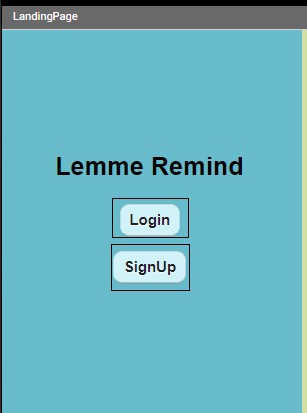

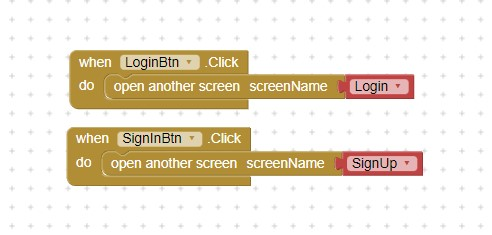

**Signup**

If a user clicks on the "Signup" button, they will be taken to the Signup Page. On this page, the user will be prompted to fill out required fields like username, email, and password. The Signup Page will check to make sure that all required fields are filled out and that the password matches the confirmed password. If there are any errors, a notifier will alert the user, indicating which fields need to be corrected. If the user successfully creates an account, they will be redirected to the Home Page.

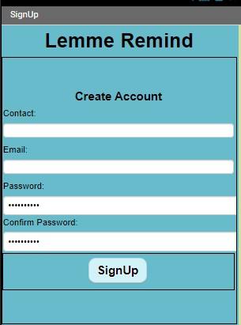

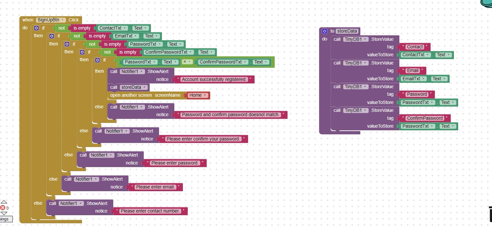

**Login**

If a user clicks on the "Login" button, they will be taken to the Login Page. On this page, the user will be prompted to enter their email and password. The Login Page will check to see if the user has previously created an account or if the entered information matches a valid user account. If the information is incorrect, a notifier will alert the user, indicating that the login information is incorrect. If the information is correct, the user will be redirected to the Home Page.

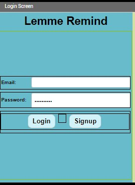

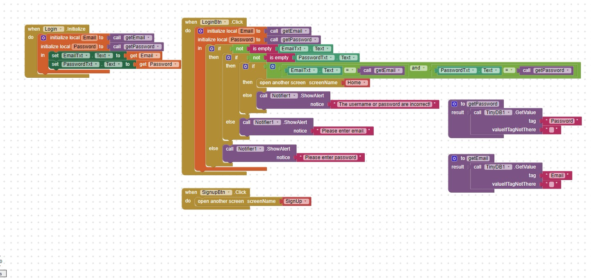

The Home Page is the main page of the app where the user will be able to see their tasks and perform various actions like creating, updating, and deleting tasks.

## Task List and User Logout

**Home**

Homepage that displays a list of all created tasks, along with a logout button and a button to create a new task, is a common feature in task management applications. The list of tasks can be displayed in a list format, with each task represented as an item in the list. Each item in the list should display some basic information about the task, such as its title, status, due date, and priority.

When a user clicks on an item in the list, the application should redirect them to the task's edit/delete page. This page should display all the details of the selected task, including its title, description, due date, priority, and status. The user should be able to edit any of these details and save their changes, or delete the task entirely.

The create task button should take the user to a form where they can enter all the details of a new task. 

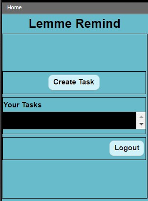

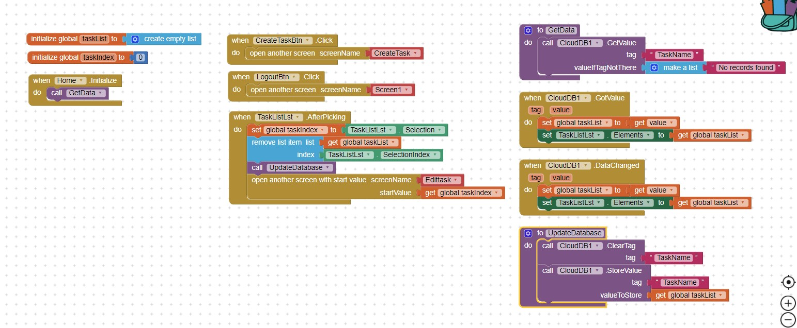

## Task Creation:
**Create Task**

Task creation is an important feature, when a user creates a new task, there are several required fields that must be validated before the task can be saved.

One of the required fields is the "Due Date" field, which is a date field that indicates when the task should be completed. Another required field is the "Priority" field, which is a list item that allows the user to specify the importance or urgency of the task. 

In addition to these required fields, there may be other fields that are required or optional depending on the specific requirements of the application and validations are notified through a notifier.

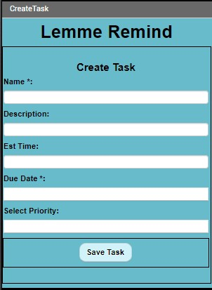

## Task Update and Delete

**Edit Task**
When a user selects a task item from the home page list, the application should redirect them to the Edit Task screen, where they can view and modify the details of the selected task. The Edit Task screen should display all the fields related to the selected task, including the task title, description, due date, priority, and status. The user should also see the Edit, Delete, and Cancel buttons on this screen.

The Edit button should allow the user to modify the task's details, such as updating the title, changing the description, selecting a new due date, updating the priority, or changing the status. Once the user has made the necessary changes, they should be able to click the Save button to save their changes to the task.

The Delete button should allow the user to delete the selected task. When the user clicks on the Delete button, the task should be permanently removed from the application.

The Cancel button should allow the user to cancel any changes they have made to the task and return to the home page. If the user clicks on the Cancel button, any changes they made to the task should be discarded, and the task should remain unchanged.

Overall, the Edit Task screen is an important part of the task management application, as it allows users to view and modify the details of their tasks. The Edit, Delete, and Cancel buttons provide the necessary functionality to allow users to make changes to their tasks or delete them entirely. 

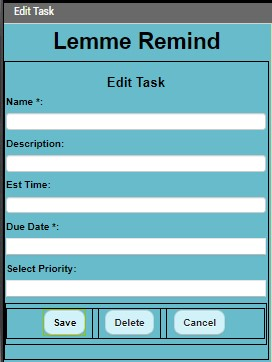

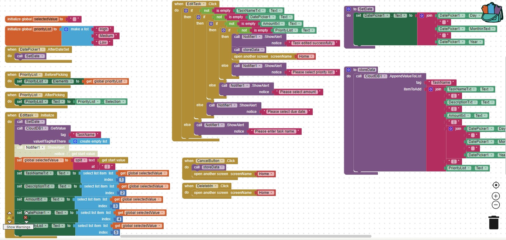

